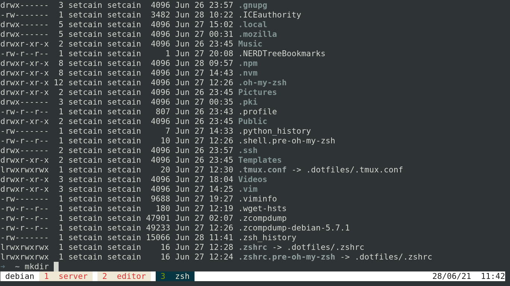
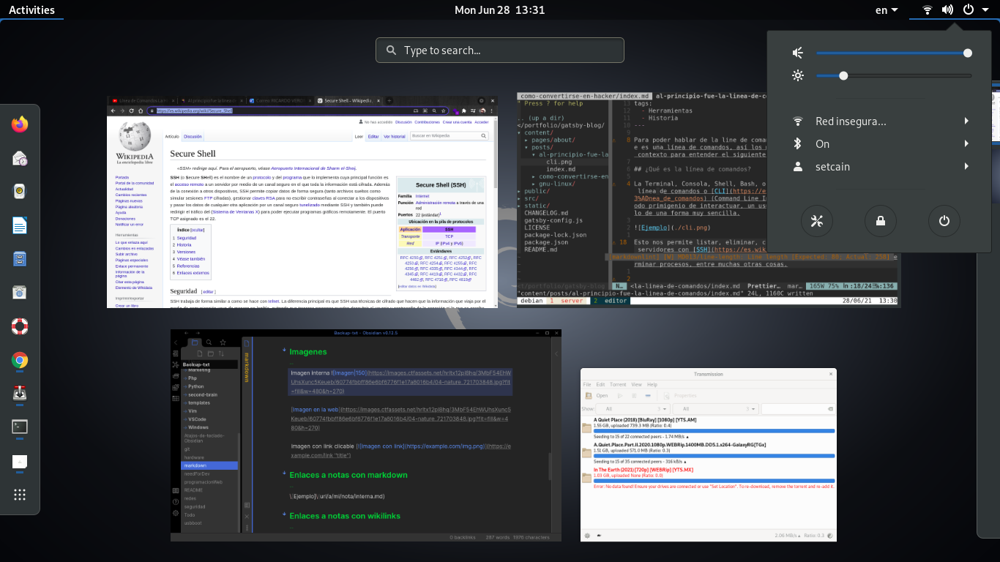

> Para poder hablar de las interfaces de usuario, primero me gustaría aclarar que es una línea de comandos y una interfaz gráfica, así los menos experimentados tendrán un buen contexto para entender el siguiente post.

## ¿Qué es CLI y GUI?

La Terminal, Consola, Shell, Bash, o algún otro nombre que se le da a la línea de comandos o [CLI](https://es.wikipedia.org/wiki/Interfaz_de_l%C3%ADnea_de_comandos) (Command Line Interface) no es otra cosa que uno de los métodos primigenios en que un usuario interactua con una computadora, por decirlo de una forma muy sencilla.

Esto nos permite listar, eliminar, crear y modificar ficheros, acceder a servidores con [SSH](https://es.wikipedia.org/wiki/Secure_Shell), tener el control de las redes de internet en nuestra computadora, lanzar o terminar procesos, entre muchas otras cosas.

A diferencia de la [GUI](https://es.wikipedia.org/wiki/Interfaz_gr%C3%A1fica_de_usuario) (Graphical User Interface) o interfaz gráfica de usuario solo nos permite abrir y cerrar ventanas, así como submenús de estas mismas y mover el cursor del mouse de un lado para el otro como un dedo virtual acusador.
Aunque claro, si te gustan los [shooters](https://es.wikipedia.org/wiki/Videojuego_de_disparos) o usar programas de Adobe o CAD veo algo complicado que te puedas desempeñar adecuadamente solo con la línea de comandos.

> En cierto modo se abusa del poder de la metáfora para hacer más accesible la interacción humano/máquina, esto limita a los usuarios solo a las funciones que se pueden hacer con un mouse.

## Origen de las interfaces de usuario
En los primeros tiempos de la informática, las computadoras no tenían GUI con escritorio, carpetas, 
puntero de mouse, iconos y todo lo que conocemos hoy en día.

En los años 60s y 70s, existían las [tarjetas perforadas](https://es.wikipedia.org/wiki/Tarjeta_perforada), que fue una de las primeras formas de interacción humano ordenador, para esto se usaba y se sigue usando el lenguaje escrito que es la forma más fácil de comunicación, recordemos que todo en el mundo de las computadoras se trata de comunicación.

En 1984 Mac y en 1985 Windows, sacaron su interfaz gráfica iniciando la era de las ventanas, esto se traduciría en un ambiente más amigable para la mayoría de personas.

¿Te has dado cuenta como las interfaces graficas simulan una oficina? Tienes tu escritorio, tu bote de basura para los archivos que vas desechando como si fueran hojas de papel, también muchos iconos son artículos de oficina, de hecho, Windows tiene su famoso [Office](https://es.wikipedia.org/wiki/Microsoft_Office) que es una colección de herramientas para, bueno... oficina.

## Como simple curiosidad
Los usuarios de Mac acusan a los usuarios de Microsoft de que [Windows](https://es.wikipedia.org/wiki/Microsoft_Windows) (su mayor éxito) es una copia de la interfaz gráfica de Mac, pero se olvidan que la manzana fue la primera en copiar el invento de Xerox llamado [WIMP](https://es.wikipedia.org/wiki/WIMP_(inform%C3%A1tica)), Ventanas, Iconos Menús y Punteros por sus siglas en inglés y por sus principales componentes, y adivina qué, este es el verdadero origen de lo que ahora conocemos como la interfaz gráfica de usuario.

## Disclaimer
Utilicé el título de un libro que he leído varias veces por lo entretenido e informativo que resulta, además fue la inspiración para crear este pequeño post.

[Al principio fue la linea de comandos](https://es.wikipedia.org/wiki/Videojuego_de_disparos)

