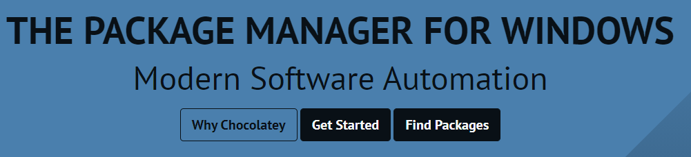
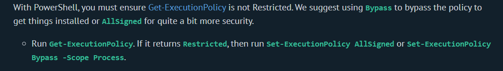
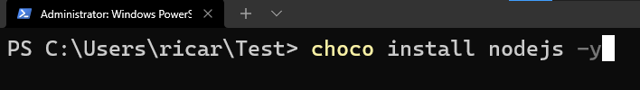
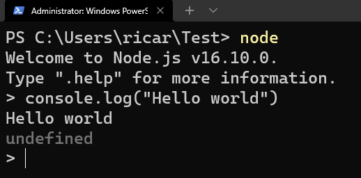

# ¿Qué es Chocolatey?

[Chocolatey](https://chocolatey.org/), es el gestor de paquetes para Windows, el cual nos permite automatizar el proceso de instalación y desinstalación del software que necesitamos en nuestro sistema operativo, esto quiere decir que nos ahorra el tedioso proceso de buscar en internet algo que queremos instalar, esperar a que se descargue el paquete .exe, correrlo, dar permisos para instalarse, el clásico siguiente, siguiente, siguiente... En fin todo un lío.

# ¿Qué es un gestor de paquetes?

Los gestores de paquetes originalmente se dieron en los sistemas operativos tipo Unix, más concretamente en Linux y sus distribuciones, su tarea primordial era agregar funcionalidad extra a estos sistemas, el gestor se encarga de instalar, actualizar, desinstalar y remover paquetes y dependencias en tu sistema, pueden tener otras opciones como listar los que paquetes que tienes instalados o saber más información de un paquete, entre otras, a esto se le llama justamente gestionar.

## Ejemplos

- ***apt*** Para Debian, Ubuntu y derivados
- ***pacman*** Para Manjaro, Endeavour, Arch y sus otras distros
- ***yum*** Para Red Hat, Centos entre otros

Si ya has programado, de seguro sabes que son las bibliotecas o comúnmente llamadas librerías, esto se emplea para desarrollar de forma más ágil y rápida, agregando funcionalidades de software a nuestro proyecto de forma muy sencilla, esto también se hace con gestores de paquetes y cada lenguaje de programación tienen uno a su disposición.

## Ejemplos de gestores de paquetes para desarrollo

- [npm](https://www.npmjs.com/) de Node.js
- [pip](https://pip.pypa.io/en/stable/) para Python
- [composer](https://getcomposer.org/) de Php



## Manos a la obra

El primer paso para instalar Choco (Como le llaman los amigos) es ir a su sitio web por un par de comandos que necesitamos para su instalación.

Click [aquí](https://chocolatey.org/install) para ver el sitio de instalación oficial de Chocolatey

También necesitamos abrir nuestra amada terminal, te dejo mi post anterior si te perdiste la parte en donde la instalamos y aprendemos los comandos principales, solo da clic [aquí](https://www.ricardoveronica.com/se-el-amo-de-windows-desde-la-terminal), tenemos que abrir la terminal de Windows en modo de administrador para la instalación, lo puedes hacer dando clic derecho en el icono de la terminal, en la opción más y correr como administrador.

Excelente, teniendo todo listo, nos fijamos en la página que acabamos de abrir que habla sobre la instalación de Choco, nos dice que tenemos que correr un comando para ver como anda nuestro sistema operativo con eso de las políticas de ejecución de scripts de terceros, para esto puedes copiar y pegar en la terminal esto

```
Get-ExecutionPolicy
```



También nos dice que si la respuesta a este comando es "Restricted" tenemos que copiar y pegar uno de los siguientes comandos

Recomendación oficial

```
Set-ExecutionPolicy Bypass -Scope Process
```

Si el anterior te regresa un error intenta con este

```
Set-ExecutionPolicy AllSigned
```

Teniendo esto, solo nos resta el último paso, la instalación directa de Choco, para esto tienes este pequeño y minúsculo comando de aquí

```
Set-ExecutionPolicy Bypass -Scope Process -Force; [System.Net.ServicePointManager]::SecurityProtocol = [System.Net.ServicePointManager]::SecurityProtocol -bor 3072; iex ((New-Object System.Net.WebClient).DownloadString('https://community.chocolatey.org/install.ps1'))
```


Puede tardar un poco dependiendo de varias variables, una de ellas es la velocidad de tu internet, otra tu memoria ram. Así que no desesperes.

Si todo estuvo bien, listo, ya tienes Choco instalado en tu sistema operativo y estas lista o listo para iniciar la acción, si te salió un error, intenta copiar y pegar directamente los comandos desde la página oficial y recuerda que necesitas correr la terminal como admin.

## Comandos básicos de Choco

Felicidades, superaste la prueba y ya estás del otro lado, ahora solo nos queda aprender a usar este manejador de paquetes en nuestro sistema operativo, te voy a dejar los comandos más usados para correrlos directamente en la terminal, recuerda que ya eres una/un Hacker, Ninja, desarrolladora/desarrollador por lo tanto sé que puedes hacerlo sin ningún contratiempo.

***Antes de escribir cualquier comando tienes que cerrar la terminal y volver a abrirla para que tome efecto la instalación de Choco, además de abrir la terminal como administrador.***

- Obtén información de choco, como usarlo, sus opciones principales y para qué sirven

```
choco -?
```

- Busca paquetes que quieres instalar en tu sistema operativo

```
choco search [nombre-de-paquete]
```

Alias para ***search***

```
choco find [nombre-de-paquete]
```

- Instalar un paquete (Ovidate de las ventanitas de siguiente, siguiente...)

```
choco install [nombre-de-paquete] -y
```

La -y es para decirle a choco "Si" a todo lo que pregunte, por ejemplo, (Estas seguro que quieres instalar el siguiente paquete)

- Desinstalar un paquete

```
choco uninstall [nombre-de-paquete]
```

- ¿Quieres saber cuantos y cuales paquetes tienes instalados?

```
choco list --local-only
```

***Es muy importante el --local-only de lo contrario en la pantalla de tu terminal terminal vas a terner todos los paquetes del repositorio de Chocolatey***

Si quieres hacer eso mejor entra [aquí](https://community.chocolatey.org/packages)

- Para solicitar información de algun paquete que instalaste usa este comando

```
choco info [nombre-de-paquete]
```

Si quieres leer la documentación de Choco da clic [aquí](https://docs.chocolatey.org/en-us/)

## Descarga tu primer paquete con Choco

Como plus porque me caíste extremadamente bien (Seguir leyéndo a alguien que esta iniciando  no debe de ser nada fácil) te voy a dejar un mini tutorial de como usar los comandos anteriores instalando un paquete desde choco, vamos a instalar Node.js, ya que esto es un blog para principiantes en el mundo de la programación "Aunque... ahora que lo pienso no lo he especificado" bueno detalles más, detalles menos, y si no estas interesad@ en programar NTP sigue mi blog y próximamente mi canal de [YouTube](https://www.youtube.com/channel/UCnd6oUDFx11ibETnPkjTVPw/featured), así tal vez te animes a aprender un poquito más de esto.

Iniciemos con esto. Para empezar déjame decirte que [Node.js](https://nodejs.org/en/) es un ambiente para [JavaScript](https://developer.mozilla.org/en-US/docs/Web/javascript) en el cual puedes ejecutar código de este mismo en cualquier lugar que instales Node y no solo en el navegador como originalmente se pensó en los 90's, esto quiere decir que también podemos escribir y ejecutar código JavaScript en nuestra amada terminal.

- Buscar el paquete de nodejs en el Repositorio de Chocolatey

```
choco find nodejs
```

Como puedes ver es el la última versión, así que pasemos directamente a instalar

Puedes ver el sitio oficial de Node.js [aquí](https://nodejs.org/en/) y la instalación comun y corriente [aquí](https://nodejs.org/en/download/)

- Instalar Node.js

```
choco install nodejs -y
```



Para abrir el [REPL de Node](https://nodejs.org/en/knowledge/REPL/how-to-use-nodejs-repl/) (Ya veremos que es esto y como usarlo) solo escribe en tu terminal

```
node
```

Despues de abrir el REPL puedes escribir directamente esto

```js
console.log("Hello world")
```



Para cerrarlo - ***CTRL + D***

Voy a dejar los comandos de listar paquetes instalados, ver más información del paquete y la desinstalación en tus manos, sé que puedes hacerlo, si necesitas ayuda, regresa a leer la lista de comandos y recuerda que puedes instalar los paquetes que quieras siempre y cuando estén en el [repositorio de Chocolatey](https://community.chocolatey.org/packages)

## Fin

En el próximo capítulo de la serie, ***"Sé el amo de Windows desde la terminal"*** (Oficialmente se acaba de convertir en una serie, jeje) veremos como escribir código directamente en la terminal de Windows ;)

Clic [aquí](https://www.ricardoveronica.com/se-el-amo-de-windows-desde-la-terminal) para la primer entrega de la serie.
