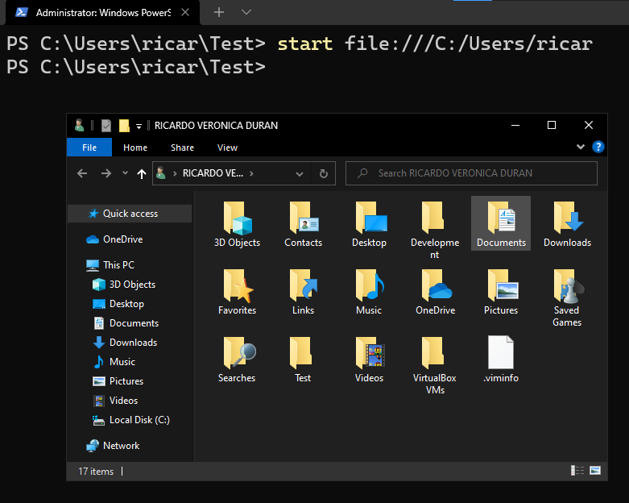
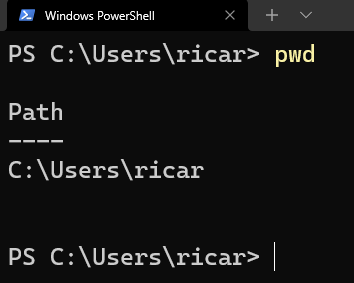

# La mejor terminal de Windows

En Windows podemos utilizar CMD, PowerShell, la terminal que te da Git cuando lo instalas en Windows llamado Git Bash o un sin fin de opciones que puedes descargar de internet, pero en esta ocasión vamos a utilizar... [Windows Terminal](https://docs.microsoft.com/es-es/windows/terminal/) esta la puedes instalar directamente desde la Store de Windows.

Elegí esta terminal pues es fácil de instalar, desde el principio tiene un look muy adecuado, tiene pestañas para abrir varias terminales y es muy personalizable.

Una vez que la instales y la abras estarás listo para escribir comandos a diestra y siniestra.

## Consideraciones antes de empezar

- La terminal te recibe con algo como esto

***PS C:\Users\ricar>***

PS es por ***P***ower ***S***hell la línea de comandos que estoy usando, lo demás es el path o la ubicación exacta dentro del disco ***C:*** en donde estoy posicionado, por último el signo mayor que, es el que nos indica que podemos iniciar a escribir comandos cuando queramos.

Recuerda que ***ricar*** es mi nombre de usuario, por lo tanto el tuyo sera diferente, al igual de en donde estes posicionado.

- Si quieres limpiar la terminal presiona las teclas

***CTRL + L***

- Para cancelar un comando cuando te hayas equivocado presiona

***CTRL + C***

- La terminal tiene autocompletado, asi que presiona la tecla que tiene un par de flechas llamada ***Tab*** al lado izquierdo de tu teclado justo arriba de ***Bloq Mayus*** para autocompletar lo que vayas escribiendo, muy utilizado al escribir nombres de carpetas o archivos.

## Que vamos a hacer

Vamos a movernos en nuestro sistema operativo desde la terminal y hacer funciones básicas sin necesitar el Mouse, es decir vamos a emular lo que haríamos con la GUI como crear, copiar, eliminar archivos y carpetas, junto con otras curiosidades bastante interesantes que te serán de ayuda frente la terminal, te lo aseguro.

> Te recomiendo que si quieres ver la magia completa tengas a un lado abierto el explorador de archivos. Puedes utilizar el siguiente comando para hacerlo, nota que yo estoy posicionado en una carpeta llamada Test, no te preocupes por eso, más adelante te enseñare como crearla con comandos de la terminal

```
start file:///
```


También puedes usar este comando para abrir directamente la carpeta principal de tu usuario, solo cambia al final mi nombre de usuario por el tuyo.

```
start file:///C:/Users/[tu-nombre-de-usuario]
```



Si quieres puedes abrir el explorador de archivos desde Google Chrome con este comando.

```
start chrome file:///C:/Users/[tu-nombre-de-usuario]
```


**O simplemente da click en el icono de la carpetita amarilla :)**

***Antes de que se me olvide***, te recomiendo también modificar una opción del explorador de archivos para que te permita ver la extensión de los files que escribamos, esto es muy importante a la hora de programar.

Esta opción la encuentras en el mismo explorador de archivos, en la barra superior - vista, detalle y seleccionando extensión de archivo como lo muestra la siguiente imagen


## Iniciando con los comandos

### Moviendote en la terminal como un ninja

Cuando quieres ver las carpetas y los archivos que están en tu usuario solo abres el explorador de archivos y ves las carpetas, Documentos, Imágenes, Videos, Descargas, y unas más.

Vamos, abre el explorador de archivos y ve a la carpeta principal de tu usuario, allí están las carpetas que crea por defecto tu sistema operativo, pero, ¿como podemos ver estas carpetas en la terminal?

Escribe el siguiente comando y veras una lista con los archivos y carpetas que puedes ver en el explorador de archivos como una lista inicandote cuando fué creada cada cosa.

Antes de esto, asegurate que estas en ***C:\Users\tu-nombre-de-usuario***

- ls de **List** en Inglés

```
ls
```

La columna ***Length*** te indica la cantidad de caracteres escritos en el archivo.

Por ahora ignora la comlumna ***Mode*** esto tiene que ver con los permisos en los sistemas tipo Unix, que veremos en otro post.


Perfecto, ahora, si por alguna razón te olvidas en que carpeta estás posicionado y no vez que al lado izquierdo de la terminal esta la ruta absoluta de la carpeta en donde estas, puedes usar este comando

- pwd de **Print Working Directory** Imprime directorio de trabajo

```
pwd 
```

Este comando es útil cuando desde tu terminal accedes a otra terminal, por ejemplo de una máquina virtual, una instancia que tienes en la nube o algún servidor que no sea tu computadora.



Muy bien es hora de movernos entre carpetas, que desde ahora en adelante llamaremos directorios ya veras porque, este comando es como si diéramos doble clic a la carpeta que quisiéramos abrir, el comando para esto es el siguiente.

- cd de **Change Directory** Cambiar de Directorio ;)

```
cd Documents 
```

Recurda que puedes presionar la tecla ***Tab*** para autocompletar mientras escribes el nombre del Directorio, por cierto, no es necesario empezar a escribir con mayúsculas.


Ahora regresa al directorio anterior, teniendo en cuenta que el directorio donde estamos posicionados es . y el directorio anterior al actual es .. con esto en mente teclea lo siguiente para regresar

```
cd ..
```

Estamos emulando el dar clic a la flecha de retroceso del explorador de archivos, esto se esta poniendo interesante, ¿no crees?

### Creación y modificación de archivos y directorios

Excelente, ya somos libres para movernos por los directorios de nuestro sistema y poder ver que hay en cada uno de ellos, es tiempo de crear nuestros propios directorios y archivos.

Veamos el primer comando que es para crear un directorio en donde estamos posicionados, llamémoslo Test

- mkdir de **make directory** hacer o crear directorio

```
mkdir Test 
```

Esto es como si diéramos clic derecho en el explorador de archivos después otro clic en nuevo, escogiéramos crear una carpeta y le pusiéramos nombre, todo esto solo con un comando en la terminal.


- New-Item o su alias **ni** crear un nuevo archivo

```
New-Item index.html
```

De nuevo, este comando nos ahorra dar clic derecho, nuevo y crear un archivo para después nombrarlo, espero que ya te estés dando cuenta los pasos que estamos ahorrando solo con un par de palabras en la terminal, y espera porque esto va a mejorar.


## Comandos para escribir y leer archivos en la terminal

Sé que están de moda editores como [VS Code](https://code.visualstudio.com/), que más que un simple editor es un IDE completo y lleno de funcionalidades excelentes, también productos como los de [Jet Brains](https://www.jetbrains.com/products/), que aunque son perfectos para ahorrar tiempo y piquetes de botones en nuestro teclado, en lo personal veo que no lo son tanto para personas que están iniciando en el mundo de la programación, pues te **pasas directamente a una solución que talvez ni siquiera sabes cuál es el problema que resuelve**, y esto lamentablemente se da muy a menudo en este mundo, siento que esto es una mala enseñanza.

Por lo tanto permíteme presentarte una de las técnicas para escribir texto dentro de un archivo, usada hace eones cuando la humanidad aún estaba en pañales, y la carne de brontosaurio era el platillo predilecto, te presento el comando...

- echo - pronunciado como eco

Con él puedes hacer varias cosas, como por ejemplo escribir en el standard output de la terminal o más importante aun, escribir en la terminal y pasar lo que escribes a un archivo sin necesidad de ningún IDE o editor de texto, anda prueba estos comandos

```
echo "<h1>Hello world</h1>"
```

---

```
echo "<h1>Hello world</h1>" > index.html
```


Como ves el primero solo imprime lo que escribes entre comillas "dobles" o 'sencillas' en la misma terminal, intenta escribir varias palabras sin comillas para que veas el resultado.

El segundo comando te permite pasar lo que escribiste por medio de un mayor que o un pipe (veremos esto en otro post) a un archivo que exista dentro del directorio en el que estás posicionado.

Lo que sigue de seguro te va a encantar, pues no necesitas ningún software extra para leer lo que acabamos de escribir en nuestro archivo HTML.

La forma más rápida de leer lo que está dentro de un archivo es directamente dentro de la terminal, estos son dos comandos que te pueden ayudar a eso

- more - Más, por su traducción en inglés

```
more index.html
```


- cat - Concat o concatenar

```
cat index.html
```


Bien, intenta escribir algo más dentro del archivo HTML de misma manera, con el signo mayor que o pipe que utilizamos para escribir el h1 y al intentar leerlo notaras algo extraño...

Lo que escribiste antes se reemplaza por lo nuevo que escribas, si lo intentas varias veces verás que siempre es así, lo anterior se borra y solo se escribe lo nuevo, esto no está bien, ¿qué tal si quiero escribir otra línea justo debajo de lo que ya tengo escrito en el archivo?

Bueno pues no te preocupes porque existe una solución a ese problema... el doble pipe

```
echo [nueva-linea-a-escribir] >> index.html
```


Cada vez que uses el doble pipe se agregara lo que escribas como una nueva línea en tu archivo, genial ¿no?


Pues tengo algo aún más genial, los archivos HTML o Hyper Text Markup Language, se usan para describir la estructura de una sitio web y cualquier página web se puede ver en un navegador de internet, así que puedes abrir tu navegador desde la terminal y pasarle el archivo que acabamos de escribir para verlo en una pestaña de Chrome, Firefox o el navegador que utilices, ahora mismo lo voy a hacer en Chrome

- start o Iniciar en español

```
start chrome file:///User/[tu-usuario]/Test/index.html
```


Recuerda que este comando solo funcionara si escribes la ruta exacta en donde esta tu archivo HTML.

## Comandos para mover y eliminar archivos

Bueno, cada vez vamos teniendo más herramientas para dominar la terminal, pero en dado caso que quisiéramos borrar todo lo que hemos hecho, ¿cuál es la forma correcta? En realidad hay muchas formas de hacerlo al igual que con los otros comandos, pero como hemos visto hasta el momento, vamos a usar la forma más directa.

Iniciemos copiando un archivo dentro de otro directorio, así como si usáramos las famosas combinaciones de teclas

***CTRL + C*** - Que se usa para copiar un archivo

***CTRL + V*** - Que se usa para pegar el archivo copiado en otro directorio

Para hacer esto existe un comando especial llamado

- cp por **Copy** o Copiar en español

Primero necesitamos crear un nuevo directorio, que es donde vamos a copiar nuestro archivo HTML, observa que estamos posicionados en el directorio Test

```
mkdir other
```


Listamos lo que tenemos en Test para asegurarnos que el directorio other se haya creado correctamente

```
ls
```


Una vez que tenemos tanto el directorio nuevo como el archivo HTML, vamos a copiar el archivo al directorio con un solo comando, te puedes ir olvidando de los clics y del Mouse en este momento :p

```
cp index.html other
```


Con el anterior comando le ordenamos al sistema copiar index.html a nuestro nuevo directorio other. Si no crees que tanta magia sea posible lista directamente el directorio other para asegurar que el archivo HTML está en ese directorio

```
ls other
```


En caso que no lo hayas notado este comando saca una copia del archivo original, por lo cual tenemos el HTML en Test y en other, que te parece si eliminamos el original, el que está en el directorio Test, esto lo puedes hacer con el siguiente comando

- rm de **Remove** de quitar/eliminar/remover en español


Perfecto, ¿te das cuenta de que no usamos para nada la tecla ***Supr*** o clic derecho sobre el archivo y eliminar?, estos detalles te hacen ahorrar mucho tiempo mientras trabajas en tu sistema operativo, además de que te hacen ver como todo un [Hacker](https://www.ricardoveronica.com/como-convertirse-en-hacker)

Muy bonito si, pero que tal si quiero mover un archivo a otro directorio, pero sin copiar nada, algo como lo que se hace con las teclas

***CTRL + X*** - Que se usa para cortar un archivo

***CTRL + V*** - La que usamos para pegar el archivo cortado de otro directorio

Buenas noticias, también hay un comando para eso

- mv por **Move** o mover en español

Este comando tiene 2 utilidades muy usadas, una es cambiar el nombre del archivo al que apuntamos, por ejemplo, podemos cambiar el nombre de nuestro amado index.html por algún otro con el siguiente comando

```
mv index.html app.html
```


Ahora usa el comando **ls** para ver que nuestro HTML ahora se llama app.html, no sé tú, pero en lo personal me encanta usar la terminal, todo es tan rápido y fluido <3

```
ls
```


La segunda utilidad es precisamente mover un archivo a otro directorio, vamos a mover app.html al directorio anterior, es decir a Test

```
mv app.html ..
```


Listo, puedes usar **ls** para ver que el HTML ya no esta. Una vez hecho esto cambiemos nuestra posicion a Test

```
cd ..
```


Usa **ls** de nuevo ahora en Test para ver que se ha copiado correctamente


Bien, ahora tenemos nuestro directorio other completamente vacío, por lo cual podemos eliminarlo con el siguiente comando. Si, también podemos eliminar directorios con el poder de un solo comando

- rmdir por **Remove Directory**

```
rmdir other
```


Ahora si lo que quieres es eliminar un directorio que tenga otros directorios o archivos dentro, también lo puedes hacer con el comando **rmdir** por ejemplo, ve al directorio anterior de Test (tú ya sabes hacer esto) e intenta borrar el mismo Test que tiene nuestro HTML adentro, te encontraras algo como esto


En resumen, este mensaje nos dice que ese directorio no está vacío pues tiene nuestro app.html dentro, si estamos seguros de borrarlo solo damos **Enter**.

Para evitar este mensaje, siempre que estemos seguros de borrar un directorio, usa el siguiente comando


Ahora estás preparado para dejar tu **Mouse** de lado y decirle a todos que eres ***el amo de Windows*** y nada ni nadie te detendrá para **conquistar el mundo**, o cualquiera que sea tu plan maligno para el futuro de la humanidad.

### Ayuda

Y bueno antes de llevar a cabo tus planes de conquista, puedes utilizar **man** para ver el manual de cualquier comando que tengas dudas o quieras profundizar en su funcionamiento.

- man de **Manual**

```
man rm
```

Este es un ejemplo con el comando ***rm***


## Conclusión

  La mejor manera de aprender es practicando, así que siéntete libre de repetir cada uno de los comandos, juega un poco, cámbialos de orden, si tienes duda de que pasa si modificas alguno, hazlo, experimenta tu mismo, ***te recomiendo que las pruebas que hagas las realices en un directorio o carpeta como el que creamos aquí llamado Test para evitar cualquier problema con algún archivo importante en alguna carpeta del sistema***, por lo demás, date gusto y recuerda que cualquier duda que tengas al respecto puedes escribirme para echarte una mano.

> El mejor sistema operativo es el que usas hoy y el mejor momento para aprender a usar la terminal es ahora
